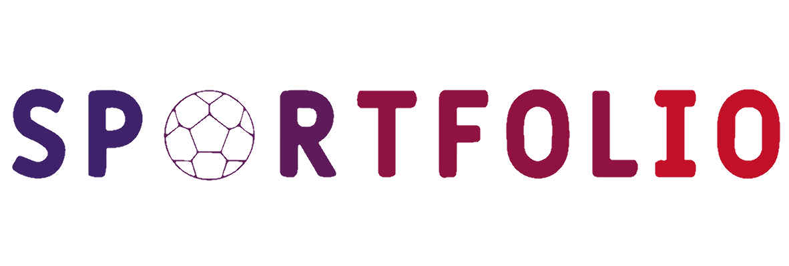

# Sportfolio - Investissement dans les talents sportifs

## Description

Sportfolio est une plateforme d'investissement basée sur la blockchain Ethereum, qui permet aux utilisateurs d'investir dans les talents sportifs émergents. La plateforme utilise la tokenisation pour représenter les talents sous forme de tokens sur la blockchain, permettant ainsi aux investisseurs d'avoir accès un à marché cloisonné, d'aider et de spéculer sur le succès de jeunes sportifs.

## Fonctionnalités

- **Tokenisation des talents :** Chaque talent sportif est représenté par un token.
- **Investissement :** Les utilisateurs peuvent acheter des tokens de talents et ainsi investir dans leur succès futur.
- **Staking :** Les investisseurs peuvent staker leurs tokens de talents pour gagner des récompenses passives basées sur les performances du talent.

## Prérequis

- Node.js et npm installés
- Un navigateur avec support de MetaMask (extension Ethereum)

## Installation

1. Clonez ce dépôt : `git clone https://github.com/DevArd/sportfolio`
2. Installez les dépendances frontend et backend. Se situer dans le dossier en question : `yarn install`

## Déploiement des Contrats

- Assurez-vous d'avoir configuré votre fichier `.env` avec vos clés d'accès à votre fournisseur Ethereum (par exemple, Infura) et votre compte Ethereum (par exemple, MetaMask).

1. Compilez les contrats : `npx hardhat compile`
2. Déployez les contrats sur le réseau de test : `npx hardhat run scripts/deploy.js --network rinkeby` (ou sur le réseau principal : `--network mainnet`)
3. Copiez les adresses de déploiement des contrats et mettez à jour les variables d'environnement dans le fichier `.env`.
4. (falcultatif) Créer et ajouter de la liquidité via les autres scrpits : `npx hardat run ./scripts/02_createPool_Mbappe_Goerli.js --network goerli` puis `npx hardat run ./scripts/05_addLiquidityPool_MBappe_Goerli.js --network goerli`

## Tests

- Lancez les tests unitaires : `npx hardhat test`

## Lancement de l'Application Frontend

1. Build l'application : `yarn build`
2. Lancez l'application frontend : `yarn dev`
3. Accédez à `http://localhost:3000` dans votre navigateur pour accéder à Sportfolio.

## Contribuer

Les contributions sont les bienvenues ! Veuillez ouvrir une "Pull Request" pour discuter des changements proposés.

## Site

- Sportfolio by vercel - [Sportfolio](https://sportfolio-drab.vercel.app/marketplace)

## Auteur

- Arnaud Planas

## Licence

Ce projet est sous licence MIT - voir le fichier [LICENSE](LICENSE) pour plus de détails.

## Remerciements

J'aimerai remercier l'équipe d'Alyra pour leur formation et leur aide tout au long des projets.

---
